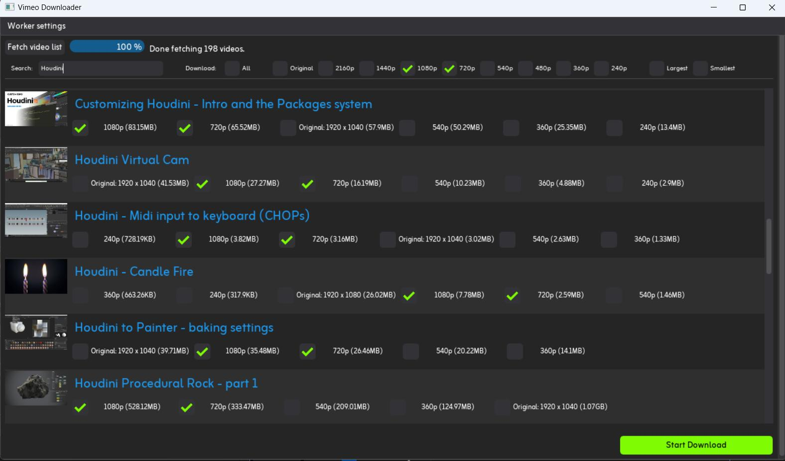

# Vimeo Downloader
 Bulk download videos from your own VIMEO channel.
 
 
## Installation:
1. Create a python virtual env: `python -m venv venv` > activate it!
2. Install requirements: `pip install -r requirements.txt`
3. Install [Playwright](https://playwright.dev/python) Chromium browser: `playwright install chromium`
4. Add your vimeo login credentials inside `./vimeo_downloader/credentials.json` file
5. Run:
	- `cd ./vimeo_downloader`
	- `python main.py`

*Make sure to have write permissions in this folder, some files will be created there!

*Tested on Python 3.12 / Windows 11

Check App usage [here](https://github.com/fabriciochamon/Vimeo_Downloader/tree/main/vimeo_downloader).

 
 
